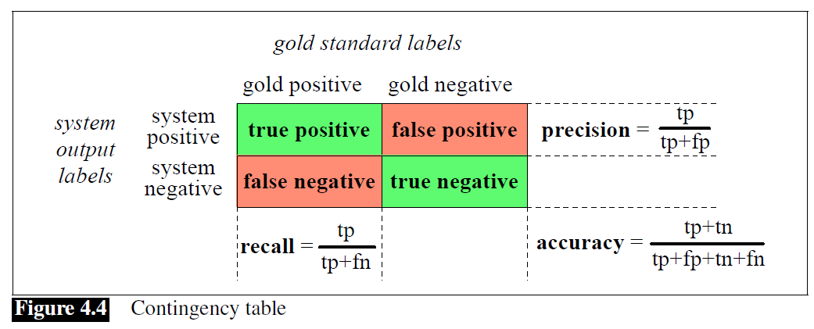

# 4.7 Evaluation: Precision, Recall, F-measure

**DEF** We often refer to the human labels we are trying to match as **gold labels**.

**DEF** To evaluate any system for detecting things, we build a **contingency table**:

