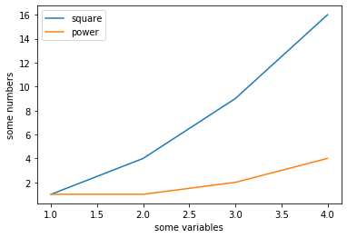

# Plotting

## Matplotlib

### Introduction

`matplotlib` 是一个可用于简单的数值绘制的库。其使用既可以遵循类似基于上下文或者说状态机的范式（pyplot-style），通过调用静态方法完成绘制，也可以遵循面向对象的范式（OO-style），使用其基本对象的方法完成绘制。绘制在图纸 `Figure` 对象上进行，一个 `Figure` 可以包含一个或多个坐标轴 `Axes` 。任何时候都存在一个当前 in-focus 的坐标轴，绘制方法默认在这个 in-focus 的坐标轴上发生作用。在简单情形下，`Figure` 和 `Axes` 可以不被显式创建。调用 `plot` 方法就会默认完成这一切。这个方法是主要的绘制方法之一，它可以接受两个数组（或 numpy 的数组）分别作为所有数据点 x 轴和 y 轴的坐标。最后，调用 `show` 方法可以将绘制好的图纸显示出来。`show` 操作会同时重置当前的图纸，接下来的绘制将在空白的新图纸上继续执行。类似的是 `savefig` 方法，它将图纸保存而不展示。

```python
import matplotlib.pyplot as plt

# pyplot style
plt.plot([1, 2, 3, 4], [1, 4, 9, 16]) # plot data. 
plt.xlabel('some variables') # set a name for the axis x
plt.ylabel('some numbers') # set a name for the axis y
plt.show() # show figure

# OO style
fig, axes = plt.subplots()
axes.plot([1, 2, 3, 4], [1, 4, 9, 16])
axes.set_xlabel('some variables')
axes.set_ylabel('some numbers')

plt.savefig('foo.png') # save instead of showing
```

.png>)

以下是  Matplotlib 中使用的主要术语。

.png>)


### More Data in Axes

```python
# labels are essential if a legend is needed.
plt.plot([1, 2, 3, 4], [1, 4, 9, 16], label="square")
plt.plot([1, 2, 3, 4], [1, 1, 2, 4], label="power")
plt.xlabel('some variables')
plt.ylabel('some numbers')
plt.legend() # add a legend
plt.show()
```



### More Data in Figure

使用 `subplot` 方法可以在一张图纸中创建多个坐标轴。可以通过两个参数控制

```python
# pyplot style
for i in range(1, 7):
    plt.subplot(2, 3, i)
    plt.plot([1,2,3],[i+1, i+2, i+3])
plt.show()

# OO style
fig, axs = plt.subplots(2,3)
for i, axs_row in enumerate(axs):
    for j, axes in enumerate(axs_row):
        c = i+j+1
        axes.plot([1,2,3],[c+1, c+2, c+3])
plt.show()
```

.png>)

## More Types of Plots

散点图可以使用 `scatter` 方法绘制：

```python
plt.scatter(x, y, s=None, c=None, marker=None, cmap=None, 
    norm=None, vmin=None, vmax=None, alpha=None, linewidths=None, *, 
    edgecolors=None, plotnonfinite=False, data=None, **kwargs)
```

使用 `s` (size) 和 `c` (color) 参数可以控制散点图的散点大小和颜色。它们都既可以是一个标量也可以是一个数组，是标量时将作用于所有数据点，是数组时则与每个数据点顺次对应。

直方图可以使用 `hist` 方法绘制，只需指定数据和 bins：

```python
plt.hist(x, bins=None, range=None, density=False, weights=None, 
    cumulative=False, bottom=None, histtype='bar', align='mid', 
    orientation='vertical', rwidth=None, log=False, color=None, 
    label=None, stacked=False, *, data=None, **kwargs)
```

bins 可以是一个数字（表示 bin 的数量），也可以是一个数列（定义所有 bins 的分界点，包括起止点）。range 指定绘制时数据的限定范围，范围外的数据会被忽略。

对于已经统计好的频率分布，可以使用 `bar` 方法绘制直方图。

```
x = [1,2,3]
y = [2,3,1]  
plt.bar(x, y)                 
plt.show()
```

 (1).png>)\`\`\`

## Styling

使用 `plot` 方法的格式化字符串可以对绘制时的样式进行简单控制。其遵循的一般格式为`[marker][line][color]` 。例如：

```python
plot(x, y, 'bo')  # plot x and y using blue circle markers
```

使用 `figsize` 参数可以控制绘制的图纸大小：

```python
fig, (ax1, ax2) = plt.subplots(2, 1, 
            figsize=(args.fig_size[0], args.fig_size[1]))
```

legend 的位置可以被定制：

```python
plt.plot([1, 2, 3], label="test1")
plt.plot([3, 2, 1], label="test2")
# Place a legend to the right of this smaller subplot.
plt.legend(bbox_to_anchor=(1.05, 1), loc='upper left', borderaxespad=0.)
plt.show()
```

.png>)

通过 `rcParams` 可以定制全局字体：

```python
plt.rcParams["font.family"] = "Times New Roman"
plt.rcParams["font.size"] = 15
```

## Seaborn

Seaborn 是一个基于 Matplotlib 封装的数据可视化库，可以更方便地完成一些风格化定制效果。

TODO

## Reference

\[1] [https://matplotlib.org/stable/tutorials/introductory/pyplot.html](https://matplotlib.org/stable/tutorials/introductory/pyplot.html)

\[2] [https://matplotlib.org/stable/tutorials/introductory/usage.html](https://matplotlib.org/stable/tutorials/introductory/usage.html#parts-of-a-figure)

\[3] [https://stackoverflow.com/questions/40734672/how-to-set-the-label-fonts-as-time-new-roman-by-drawparallels-in-python/40734893](https://stackoverflow.com/questions/40734672/how-to-set-the-label-fonts-as-time-new-roman-by-drawparallels-in-python/40734893)

\[4] [https://matplotlib.org/stable/tutorials/intermediate/legend\_guide.html](https://matplotlib.org/stable/tutorials/intermediate/legend\_guide.html)

\[5] [https://matplotlib.org/stable/api/\_as\_gen/matplotlib.pyplot.scatter.html](https://matplotlib.org/stable/api/\_as\_gen/matplotlib.pyplot.scatter.html)

\[6] [https://stackoverflow.com/questions/332289/how-do-you-change-the-size-of-figures-drawn-with-matplotlib](https://stackoverflow.com/questions/332289/how-do-you-change-the-size-of-figures-drawn-with-matplotlib)

\[7] [https://matplotlib.org/stable/api/\_as\_gen/matplotlib.pyplot.hist.html](https://matplotlib.org/stable/api/\_as\_gen/matplotlib.pyplot.hist.html)

\[8] [https://stackoverflow.com/questions/9622163/save-plot-to-image-file-instead-of-displaying-it-using-matplotlib](https://stackoverflow.com/questions/9622163/save-plot-to-image-file-instead-of-displaying-it-using-matplotlib)

\[9] [https://matplotlib.org/stable/api/\_as\_gen/matplotlib.pyplot.plot.html#matplotlib.pyplot.plot](https://matplotlib.org/stable/api/\_as\_gen/matplotlib.pyplot.plot.html#matplotlib.pyplot.plot)

\[10] [https://stackoverflow.com/questions/21195179/plot-a-histogram-from-a-dictionary](https://stackoverflow.com/questions/21195179/plot-a-histogram-from-a-dictionary)

